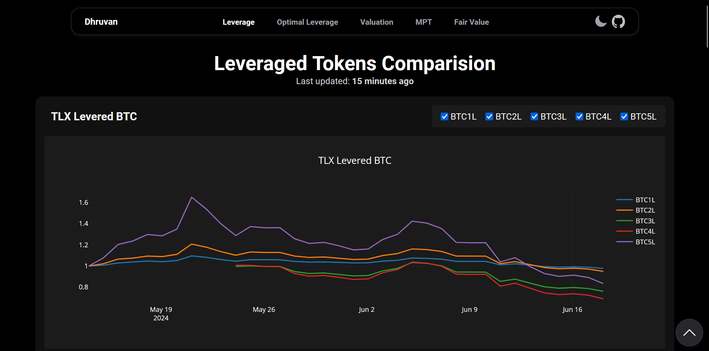

# Dhruvan Gnanadhandayuthapani

This web app aims to piece all the scattered analyses performed by me in one place. 

Access the live website [here](https://www.gnanadhandayuthapani.com).

## Installation

1. Clone the repository
```bash
git clone https://github.com/dhruvan2006/website.git
cd website
```
### Backend
2. Setup and run the Flask server
```bash
cd flask-backend
python -m venv .venv
source .venv/bin/activate
pip install -r requirements.txt
flask run
```
3. Setup and run the Express server
```bash
cd express-backend
npm install
node app.js
```
### Frontend
4. Navigate to the frontend
```bash
cd frontend
```
5. Install dependencies
```bash
npm install
```
6. Start the development server
```bash
npm start
```

## Usage
You should be greeted by this!!!

 